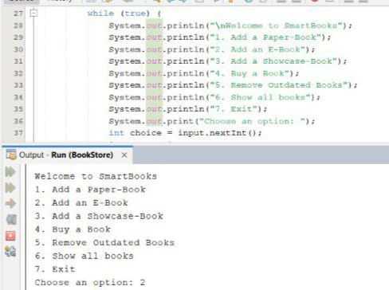

# SmartBooks

SmartBooks is a Java-based bookstore management system that allows users to:

1. Add a Paper-Book  
2. Add an E-Book  
3. Add a Showcase-Book  
4. Buy a Book  
5. Remove Outdated Books  
6. Show All Books  
7. Exit  

## Features

- Add different types of books (Paper, E-Book, Showcase).
- Buy books by providing ISBN and customer details.
- Remove books older than a specified number of years.
- View all books currently in inventory.

---

## Screenshots

### 1. Adding Initial Books

### 2. Menu Display

### 3. Adding an E-Book

### 4. Display All Books After add_ebook

### 5. Buying a Book

### 6. Removing Outdated Books

### 7. Exit Program
